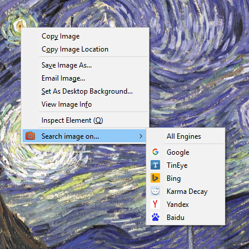
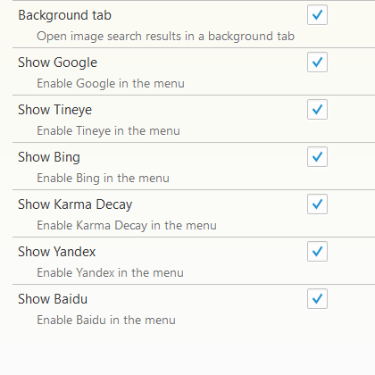

# Image Search Addon for Firefox

```Image Search``` is a Firefox addon allowing you to search using images across the most popular search engines: Google, TinEye, Bing, Karma Decay, Yandex and Baidu.

# Usage



With the addon enabled, when right clicking on an image you have the ```Search image with...``` option, in which you can choose among the enabled search engines.

# Options



Under the addon options, you can select the focus of the results tab(background or foreground), and enable or disable the following search engines:

* Google
* TinEye
* Bing
* Karma Decay
* Yandex
* Baidu

# Installation

## Requirements

* ```Firefox 38+```

## AMO

Install directly from [AMO](https://addons.mozilla.org/en-US/firefox/addon/rev-image-search/) (Not yet signed)

<!--## Github-->

## Manually

Download or clone the repository to your local machine

```git clone https://github.com/akisman/firefox-reverse-image-search```

Then, using [jpm](https://developer.mozilla.org/en-US/Add-ons/SDK/Tools/jpm#Installation) you can either test it using ```jpm run``` or package it using ```jpm xpi```.

# License

Copyright © 2015 Akis Manolis https://github.com/akisman

Image Search is licensed under the MIT licence. All rights not explicitly granted in the MIT license are reserved. See the included LICENSE file for more details.